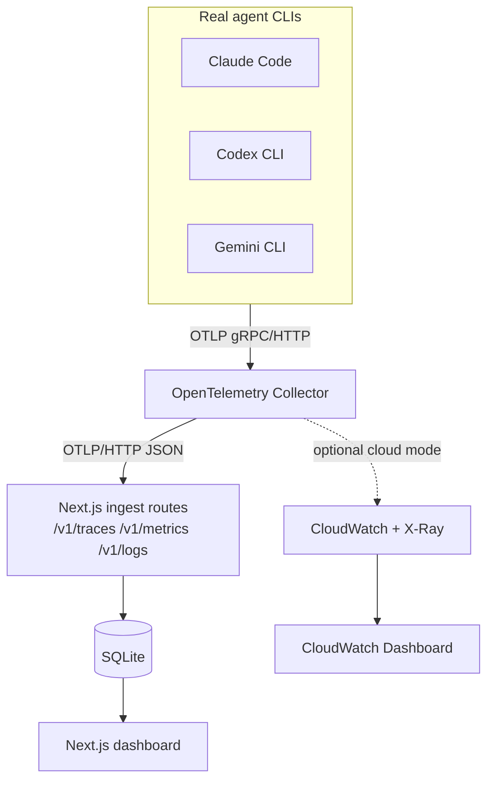

# AI Coding Agent Observatory

An observability platform for AI coding agents — Claude Code, OpenAI Codex CLI, and Google Gemini CLI. It ingests each agent's **real, native OpenTelemetry telemetry** (no synthetic data), stores it locally in SQLite, and renders it in a Next.js dashboard. An optional Terraform-managed AWS path mirrors the same telemetry into CloudWatch/X-Ray for a `terraform apply` / `terraform destroy` demo.

See [docs/PRD.md](docs/PRD.md) for the full product spec, [docs/adr/0001-architecture-and-tech-stack.md](docs/adr/0001-architecture-and-tech-stack.md) for why things are built this way, [docs/ROADMAP.md](docs/ROADMAP.md) for build status and what's next, and [docs/MILESTONES.md](docs/MILESTONES.md) for a log of what's shipped so far.

## Architecture



Local mode is two Docker services: `otel-collector` and `dashboard`. There is no bundled data generator — telemetry only appears once a real agent is pointed at the collector.

## Quickstart

```bash
git clone <this-repo>
cd ai-coding-agent-observatory
docker compose -f infra/docker/docker-compose.yml up --build
```

Open [http://localhost:3000](http://localhost:3000). Then connect a real agent — see **[docs/CONNECT_AGENTS.md](docs/CONNECT_AGENTS.md)** for exact configuration for Claude Code, Codex CLI, and Gemini CLI. Sessions appear on the Overview page within seconds of the agent's next telemetry export.

## Dashboard

- **Overview** — fleet-wide KPIs and recent activity
- **Sessions** — filterable list of agent sessions
- **Timeline** — per-session trace/event waterfall
- **Metrics** — latency, cost, and token charts
- **Leaderboard** — agents/models ranked by cost-efficiency, speed, and success rate

## Cloud mode (optional)

```bash
cd infra/terraform
terraform init
terraform apply
```

Provisions CloudWatch (log group + dashboard) and IAM by default; Lambda, DynamoDB, and X-Ray are optional, feature-flagged modules (see `terraform.tfvars.example`). No EC2/ECS/EKS is ever created.

Then, one-time manual step (Terraform deliberately doesn't create this — see [ADR 0001, D12](docs/adr/0001-architecture-and-tech-stack.md#d12-no-aws_iam_access_key-resource--credentials-are-a-manual-step)):

```bash
aws iam create-access-key --user-name "$(terraform output -raw collector_iam_user_name)"
```

Put the resulting keys in `.env`, then run the cloud-mode collector and point an agent at it:

```bash
docker compose -f infra/docker/docker-compose.cloud.yml up
```

Run `terraform destroy` when done.

### Cost

Default `terraform apply` (no optional modules) creates 5 resources, all free or effectively free at demo scale (us-east-1, approximate — check [AWS's own pricing pages](https://aws.amazon.com/cloudwatch/pricing/) for current rates):

| Resource | Approx. cost |
|---|---|
| CloudWatch log group (14-day retention) | ~$0.50/GB ingested + $0.03/GB stored — fractions of a cent at demo volume |
| CloudWatch dashboard | Free (first 3 dashboards/account) |
| CloudWatch custom metrics (EMF, via the collector) | First 10 metrics/month free (AWS Free Tier, new accounts); ~$0.30/metric/month after that — this project declares 4 |
| IAM user + policy | Always free |

Optional modules, only created if you flip their feature flag in `terraform.tfvars` / `deploy-aws.yml` inputs:

| Resource | Approx. cost |
|---|---|
| DynamoDB (`enable_dynamodb`) | Pay-per-request: $1.25/million writes, $0.25/million reads — negligible at demo scale |
| Lambda (`enable_lambda`) | Free tier: 1M requests + 400,000 GB-seconds/month — effectively free here |
| X-Ray (`enable_xray`) | Free tier: 100,000 traces recorded/month, 1,000,000 traces retrieved/month |

Nothing here runs continuously that accrues cost while idle except the CloudWatch log group's storage (trivial at this scale) — there's no EC2/ECS/EKS and no always-on compute. Run `terraform destroy` after a demo session to remove everything, including that storage.

## Repository layout

```
apps/dashboard/       Next.js app: UI, OTLP ingest routes, query API, SQLite
packages/shared/       Shared types + real per-agent OTel attribute constants
infra/docker/           Dockerfiles, docker-compose.yml, collector configs
infra/terraform/        AWS modules (cloudwatch, iam, lambda, dynamodb, xray)
.github/workflows/      CI, Terraform validation, gated AWS deploy
docs/                   PRD, ADR, roadmap, agent connection guide
```

## Development

```bash
npm install
npm run build --workspace=packages/shared
npm run dev --workspace=apps/dashboard
```

```bash
npm run lint
npm run typecheck
npm test
```

## Status

Local mode (Docker Compose, ingest pipeline, SQLite storage, all five dashboard pages) is built and verified end to end. Cloud mode has been deployed for real: `terraform apply` succeeded against a live AWS account (CloudWatch log group + dashboard, IAM policy/user). CI is confirmed green on GitHub Actions. Remaining: connect a real agent through cloud mode to verify data in CloudWatch, then `terraform destroy` when done. See [docs/ROADMAP.md](docs/ROADMAP.md) for the current phase and [docs/MILESTONES.md](docs/MILESTONES.md) for what's shipped.
