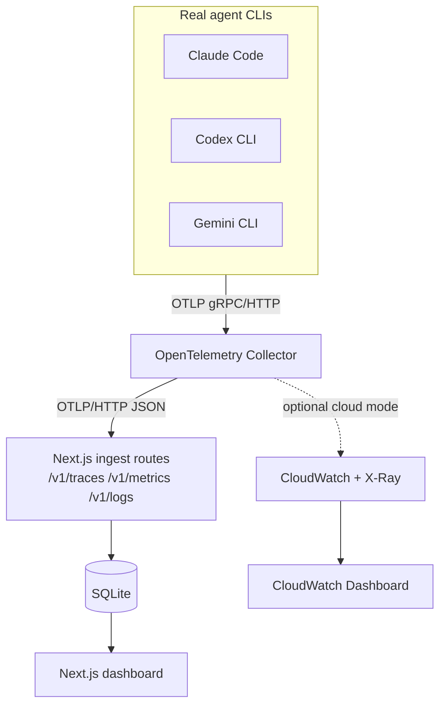

# AI Coding Agent Observatory

An observability platform for AI coding agents — Claude Code, OpenAI Codex CLI, and Google Gemini CLI. It ingests each agent's **real, native OpenTelemetry telemetry** (no synthetic data), stores it locally in SQLite, and renders it in a Next.js dashboard. An optional Terraform-managed AWS path mirrors the same telemetry into CloudWatch/X-Ray for a `terraform apply` / `terraform destroy` demo.

See [docs/PRD.md](docs/PRD.md) for the full product spec, [docs/adr/0001-architecture-and-tech-stack.md](docs/adr/0001-architecture-and-tech-stack.md) for why things are built this way, and [docs/ROADMAP.md](docs/ROADMAP.md) for build status and what's next.

## Architecture



Local mode is two Docker services: `otel-collector` and `dashboard`. There is no bundled data generator — telemetry only appears once a real agent is pointed at the collector.

## Quickstart

```bash
git clone <this-repo>
cd ai-coding-agent-observatory
docker compose -f infra/docker/docker-compose.yml up --build
```

Open [http://localhost:3000](http://localhost:3000). Then connect a real agent — see **[docs/CONNECT_AGENTS.md](docs/CONNECT_AGENTS.md)** for exact configuration for Claude Code, Codex CLI, and Gemini CLI. Sessions appear on the Overview page within seconds of the agent's next telemetry export.

## Dashboard

- **Overview** — fleet-wide KPIs and recent activity
- **Sessions** — filterable list of agent sessions
- **Timeline** — per-session trace/event waterfall
- **Metrics** — latency, cost, and token charts
- **Leaderboard** — agents/models ranked by cost-efficiency, speed, and success rate

## Cloud mode (optional)

```bash
cd infra/terraform
terraform init
terraform apply
```

Provisions CloudWatch (log group + dashboard) and IAM by default; Lambda, DynamoDB, and X-Ray are optional, feature-flagged modules (see `terraform.tfvars.example`). No EC2/ECS/EKS is ever created. Run `terraform destroy` when done.

## Repository layout

```
apps/dashboard/       Next.js app: UI, OTLP ingest routes, query API, SQLite
packages/shared/       Shared types + real per-agent OTel attribute constants
infra/docker/           Dockerfiles, docker-compose.yml, collector configs
infra/terraform/        AWS modules (cloudwatch, iam, lambda, dynamodb, xray)
.github/workflows/      CI, Terraform validation, gated AWS deploy
docs/                   PRD, ADR, roadmap, agent connection guide
```

## Development

```bash
npm install
npm run build --workspace=packages/shared
npm run dev --workspace=apps/dashboard
```

```bash
npm run lint
npm run typecheck
npm test
```

## Status

Under active development — see [docs/ROADMAP.md](docs/ROADMAP.md) for the current phase and what's next.
